# DCC Translation Pipeline


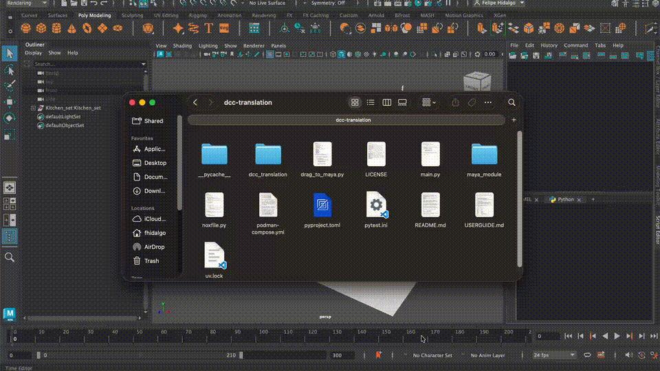

A production-oriented Pipeline TD project focused on validation, scene translation, and USD publishing workflows between Autodesk Maya and Unreal Engine using OpenUSD.

The system validates Maya scenes using configurable YAML rule profiles, converts scene data into a lightweight SceneGraph abstraction, exports structured USD stages, generates publish metadata, and records translation activity through interchangeable backend registries.

## Problem

Modern VFX and game pipelines transfer large amounts of scene data between different DCC applications, often leading to:

- Inconsistent assets
- Failed imports
- Manual cleanup workflows
- Non-standardized publishing pipelines

This project explores how validation-driven publishing workflows and OpenUSD can improve reliability and interoperability across production environments.

## Key Features

- Maya validation and publishing plugin
- OpenUSD export pipeline
- Lightweight SceneGraph abstraction
- YAML-driven validation profiles
- PySide6 validation UI
- Unreal Engine workflow support
- SQLite and MongoDB registry backends
- Automated testing with Nox and mayapy
- Drag-and-drop Maya installation
- CLI publishing workflows

## Pipeline Architecture

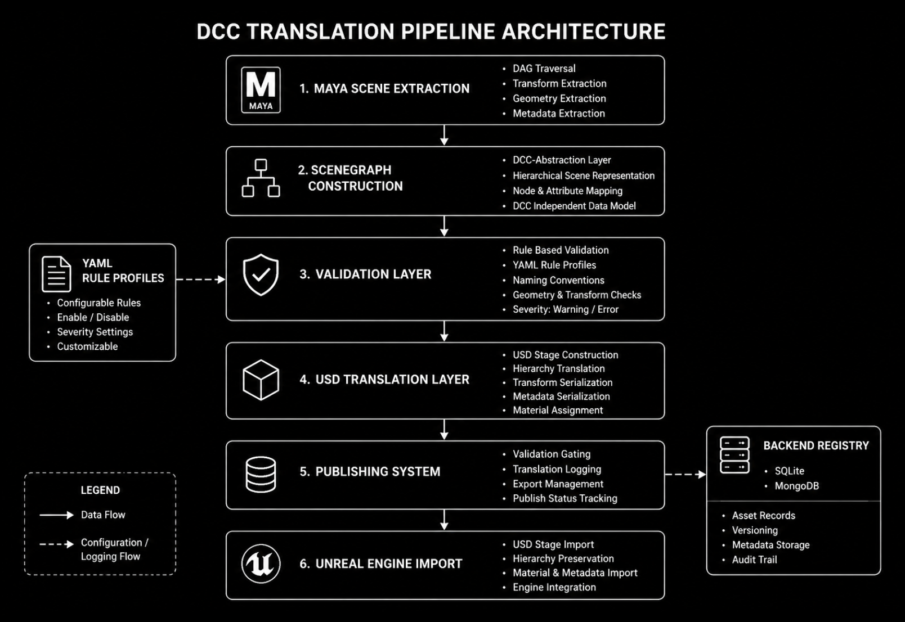

The DCC Translation Pipeline is built around a modular validation-driven publishing workflow designed to standardize scene translation between Autodesk Maya, OpenUSD, and Unreal Engine. The system begins with Maya scene extraction, where DAG hierarchy, transforms, geometry, and metadata are converted into a lightweight DCC-independent SceneGraph representation.

Validation is performed through configurable YAML rule profiles before the scene is translated into a USD stage using the OpenUSD API. The publishing system then generates structured metadata and records translation activity through interchangeable backend registries such as SQLite and MongoDB. Finally, exported USD stages can be imported into Unreal Engine while preserving scene hierarchy and per-object separation.

## Translation Pipeline Execution

The SceneGraph intentionally stores only essential structural data required for cross-DCC translation and USD stage construction.

```
Maya Scene Extraction
    > Validation Layer (YAML Rule Profiles)
        > SceneGraph Construction
            > USD Export (Stage construction)
                > Metadata Serialization
                    > Translation Logging - Backend Registry (SQLite / MongoDB)
                        > Unreal Engine Import
```

## Demo

<details>
<summary>Maya DCC Translation Plugin UI</summary>

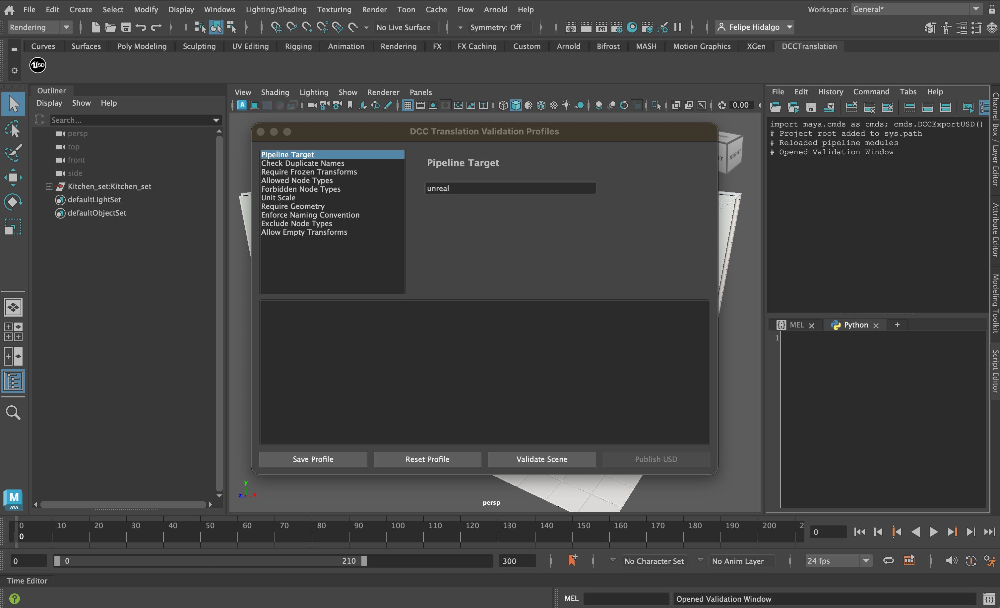
</details>

<details>
<summary>YAML Validation</summary>

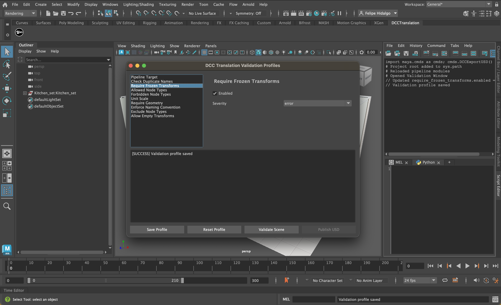
</details>

<details>
<summary>YAML Validation - Error</summary>

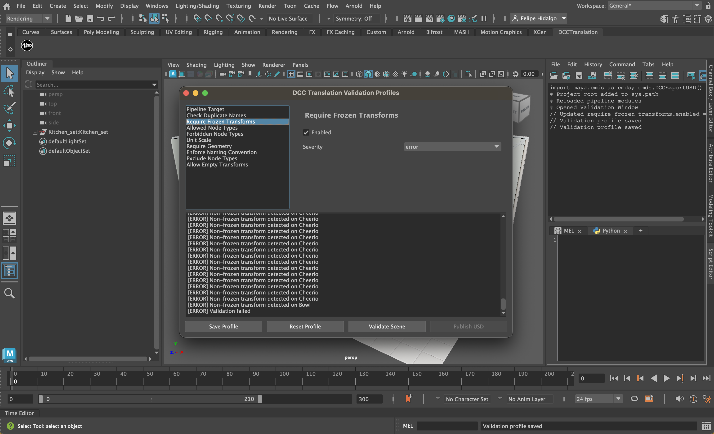
</details>

<details>
<summary>YAML Validation - Success</summary>

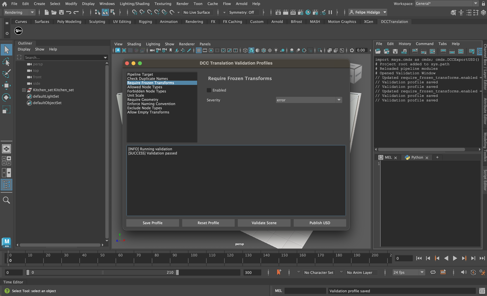
</details>

<details>
<summary>OpenUSD Publish</summary>

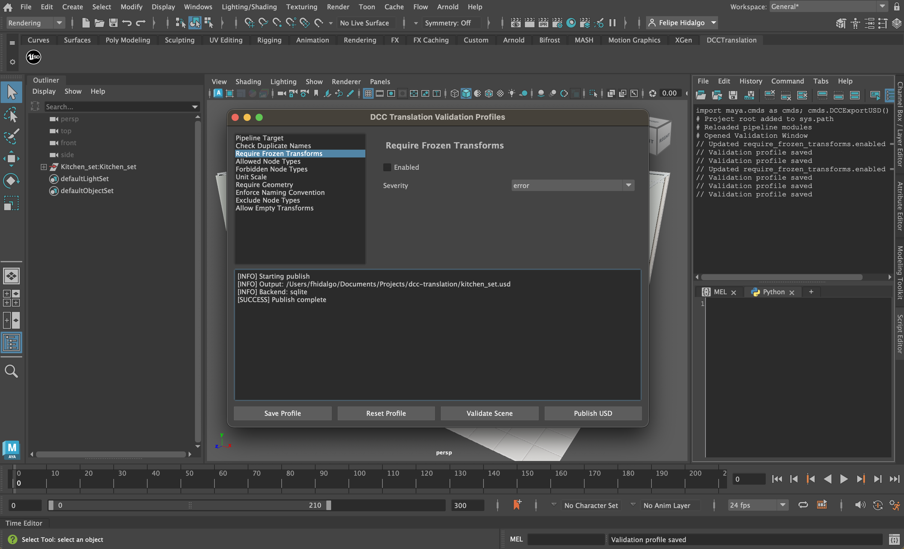
</details>

<details>
<summary>UE5 Import</summary>

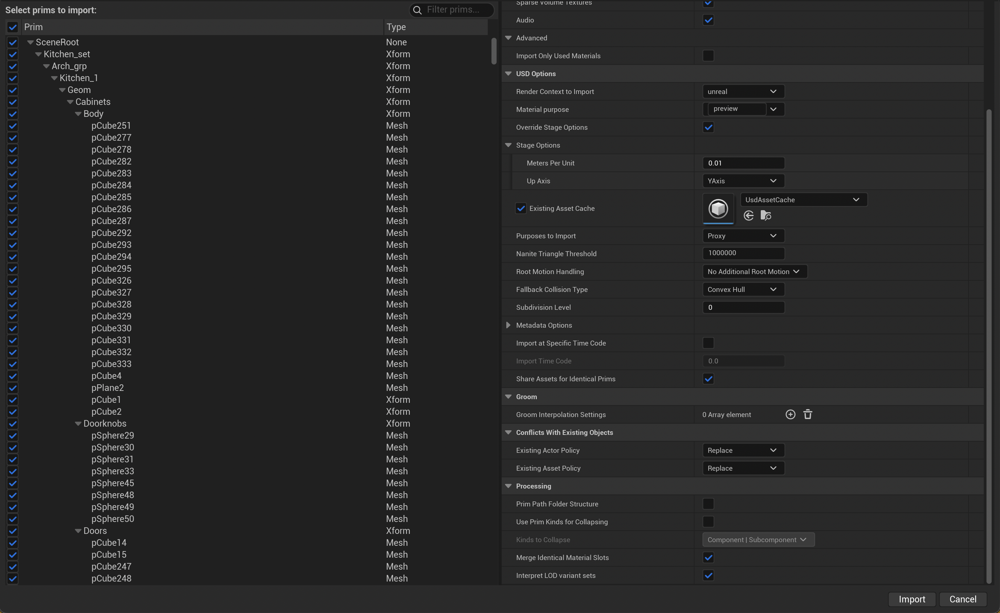
</details>

<details>
<summary>UE5 Complete</summary>

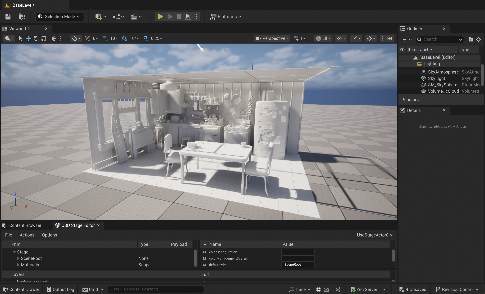
</details>

<details>
<summary>Backend Registry - MongoDB</summary>

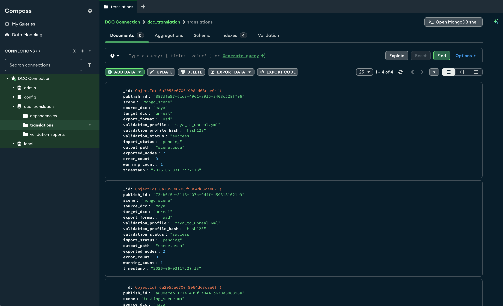
</details>

<details>
<summary>CLI</summary>

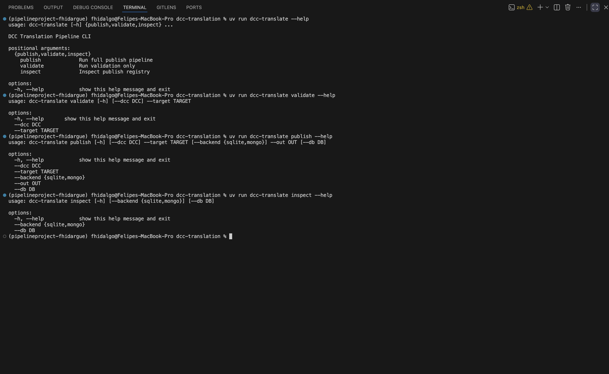

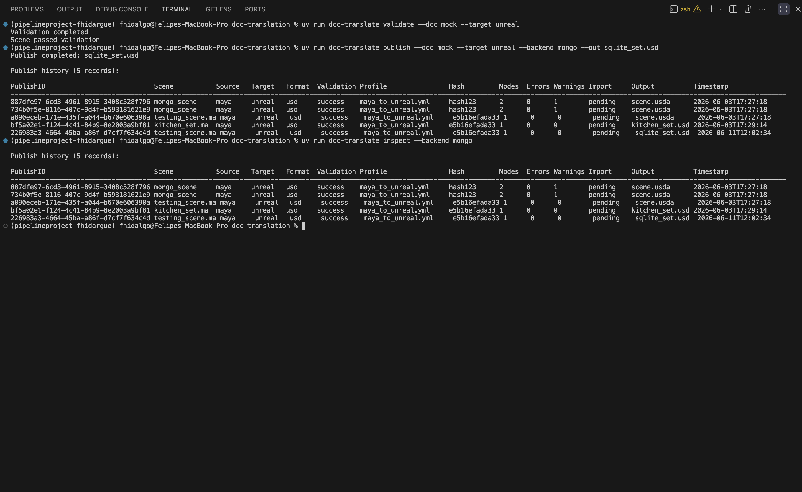
</details>

## User Guide

Please refer to the  documentation file for installation and usage instructions.

Project showcase and walkthrough video:

https://www.youtube.com/watch?v=HBnfSlUyQT8

## Future Extensions

- Houdini SceneGraph adapter.
- REST publishing service.
- Live changes with Websockets.
- Batch scene processing.
- Asset version tracking.
- Dependency graph validation.
- Cloud registry backends.
- Automated Unreal Engine import workflows using the Unreal Python API.
- Automated asset publishing and scene reconstruction inside Unreal Engine.
